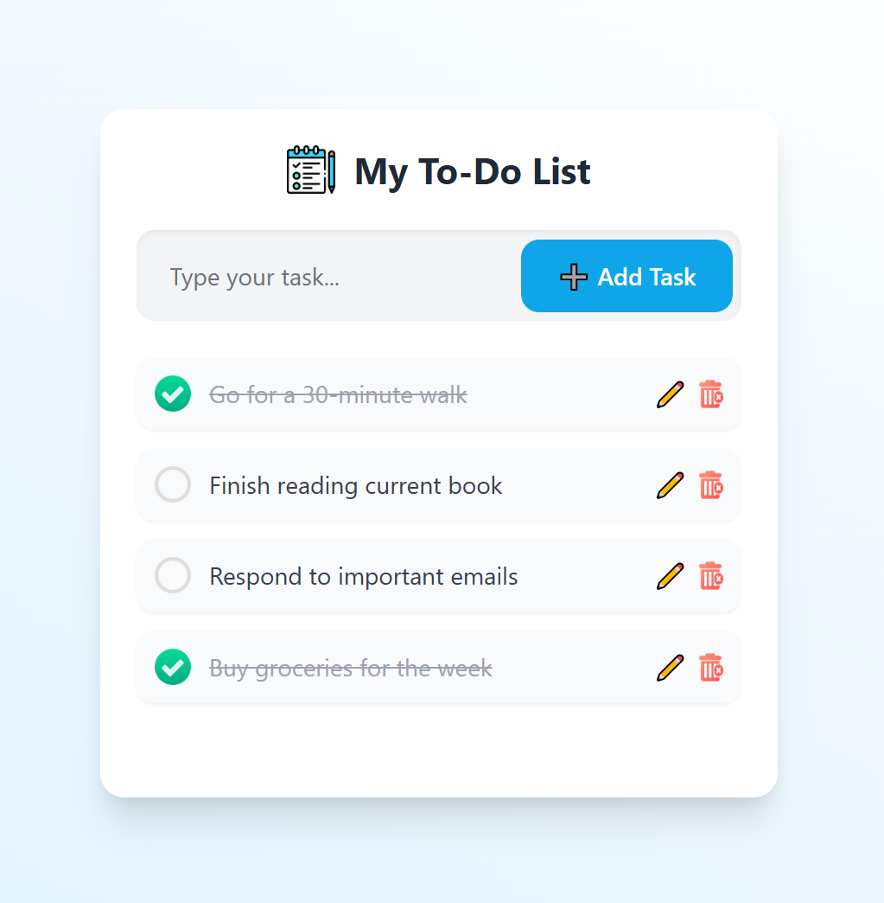

# 📝 Elegant Todo App

**Live Preview**: [Click here to view the app](https://ffmahani.github.io/todo-app/)

This is a beautifully designed and responsive Todo List web application built with **React**, **Vite**, and **Tailwind CSS**. It includes features such as:

- Adding, deleting, and editing tasks
- Marking tasks as complete/incomplete
- Responsive layout for mobile and desktop
- Local storage persistence
- Clean and elegant user interface



---

## 🚀 Features

- ✅ Add, delete, and edit your tasks
- ✅ Mark tasks as done/undone
- 💾 Tasks persist in **local storage**
- 📱 Mobile-first and fully **responsive** design
- 🌈 Elegant UI with smooth transitions
- 🔁 Keyboard interaction (e.g., Enter to add)

---

## 📂 Folder Structure

```
todo-app/
├── public/
│   └── screenshot.png
├── src/
│   ├── assets/
│   ├── components/
│   │   ├── TodoInput.jsx
│   │   ├── TodoItem.jsx
│   │   └── TodoList.jsx
│   ├── App.jsx
│   ├── main.jsx
│   └── index.css
├── package.json
└── README.md
```

---

## 🛠️ Installation & Setup

```bash
git clone https://github.com/FFMahani/todo-app.git
cd todo-app
npm install
npm run dev
```

---

## 🖼️ Example Tasks for Demo

You can use these to populate for screenshots:
- Finalize project proposal
- Attend team sync meeting
- Respond to pending emails
- Grocery shopping
- Book flight tickets
- Update project roadmap
- Read 20 pages of a book

---

## 🛡 License

This project is open-source and available under the [MIT License](LICENSE).

---

Built with ❤️ by [@FFMahani](https://github.com/FFMahani)
